#  updownGG


## 📌 프로젝트 소개
> League of Legends 게임 내 소환사들을 위한 전적 검색 및 평가 시스템 플랫폼입니다.  
> 전적 검색 기능에 더해, 함께 게임을 플레이한 소환사에 대한 평가 시스템을 제공합니다.

## 📱 미리보기
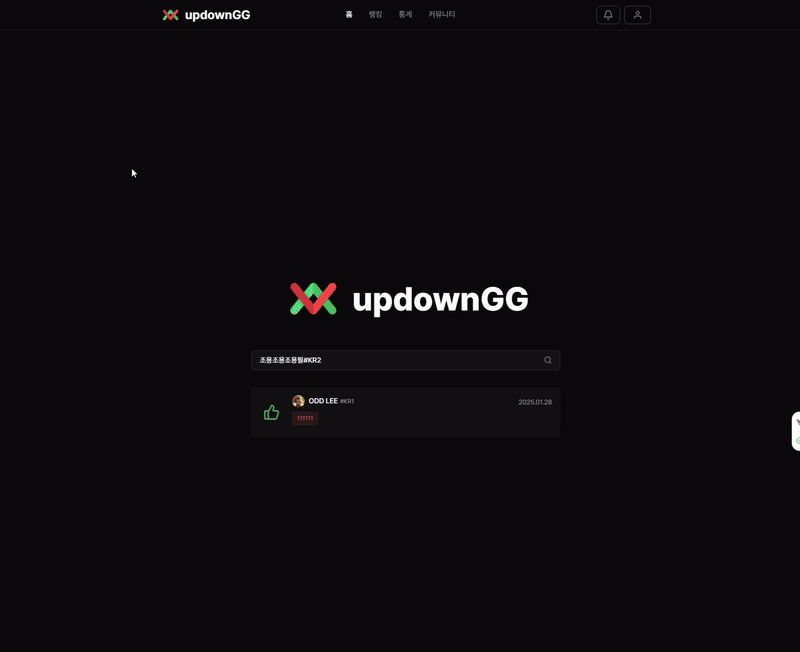

<br>

## ⭐ 주요 기능

### 🎮 소환사 평가 시스템
```
📝 함께한 게임 플레이어를 평가하세요!
```
- 최근 7일간 함께 게임을 플레이한 소환사 평가 기능
- UP/DOWN 평가와 함께 플레이스타일 태그 및 상세 평가 작성
- 평가는 로그인한 사용자의 소환사 페이지에서만 가능
- 익명/실명 선택 가능한 평가 시스템
- 커스텀 태그 신청 기능 (관리자 승인 후 사용 가능)

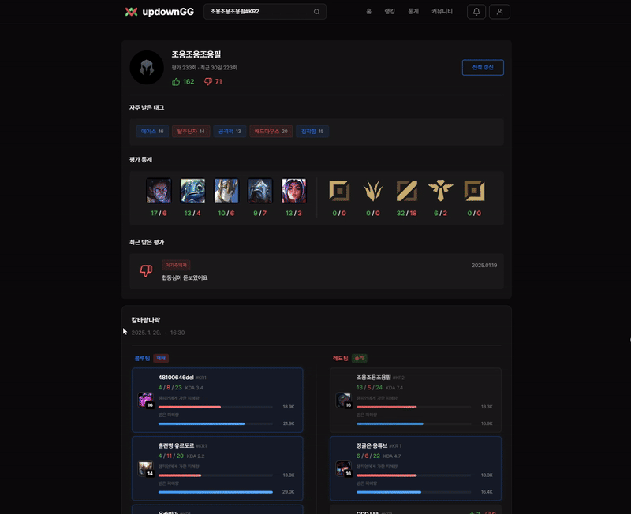

### 🔍 소환사 전적 검색
```
📊 상세한 게임 전적을 확인하세요!
```
- 소환사의 게임 전적 및 상세 정보 조회
- 매치별 참여 소환사들의 상세 정보 제공
- 챔피언별, 포지션별 통계 제공


### 📋 리뷰 히스토리
```
✍️ 작성하거나 받은 평가를 확인하세요!
```
- 작성한 리뷰/받은 리뷰 구분하여 조회
- 게임 정보와 함께 리뷰 내용 확인 가능
- 작성한 리뷰 수정 기능
- 실시간 알림 기능으로 새로운 평가 확인


### 👥 듀오 찾기 커뮤니티
```
🤝 함께 게임할 듀오를 찾아보세요!
```
- 포지션별, 큐 타입별 듀오 구인
- 게임 모드 및 티어별 필터링 기능
- 작성자의 최근 플레이 챔피언 및 평가 정보 제공
- 디스코드 연동을 통한 빠른 소통

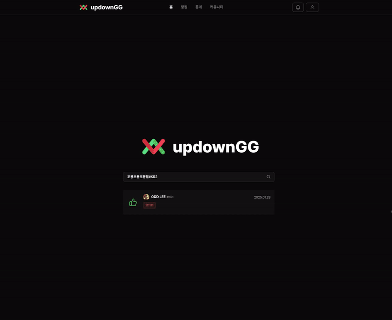

<br>

## 🎯 페이지 구성

### 1️⃣ 홈 페이지
```
🏠 간편한 검색으로 시작하세요
```
- 소환사 검색 기능 제공
- 직관적인 검색 인터페이스

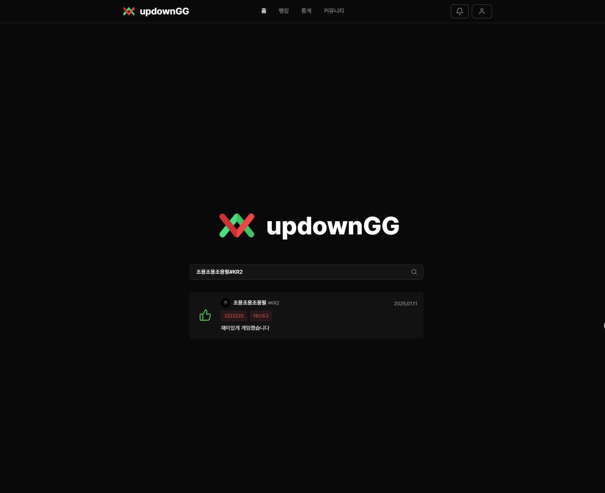

### 2️⃣ 랭킹 페이지
```
👑 최고의 평가를 받은 소환사를 확인하세요
```
#### 표시 정보
- 프로필 아이콘
- 소환사 아이디
- 평가 횟수 (전체/최근 30일)
- UP/DOWN 수
- 리뷰 점수 (UP/DOWN 비율 기반)
- 많이 받은 태그 TOP 3
- 챔피언별 평가 통계

#### 필터링
- 기간별 필터링
- 포지션별 필터링

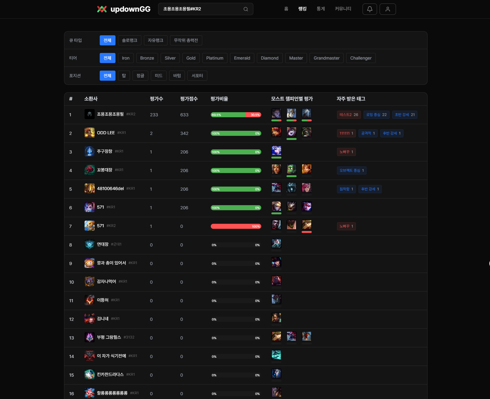

### 3️⃣ 통계 페이지
```
📈 상세한 통계 정보를 확인하세요
```
#### 챔피언별 통계 정보
- 챔피언 정보
- 플레이 수
- 평가 수
- UP/DOWN 수
- 자주 받는 태그

#### 필터 및 정렬
| 필터링 | 정렬 기능 |
|--------|-----------|
| • 큐 타입<br>• 티어<br>• 기간<br>• 포지션 | • 모든 항목 정렬 가능<br>• 오름차순/내림차순 지원 |

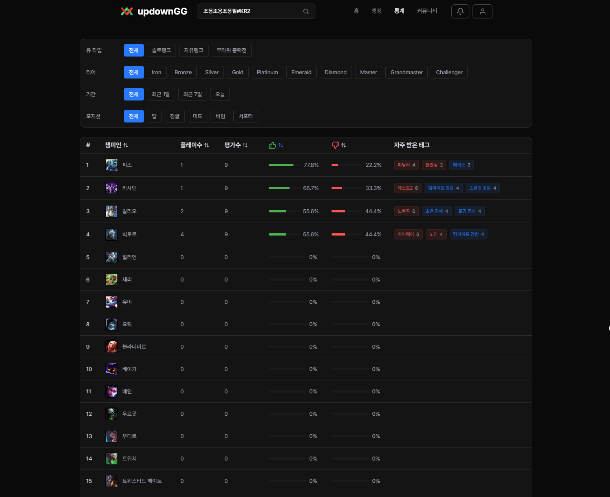

### 4️⃣ 소환사 페이지
```
👤 소환사의 모든 정보를 한눈에 보세요
```
#### 프로필 섹션
| 기본 정보 | 평가 통계 |
|-----------|-----------|
| • 프로필 아이콘<br>• 소환사 닉네임<br>• 태그 | • 전체/최근 30일 평가 횟수<br>• UP/DOWN 수<br>• 많이 받은 태그 TOP 3 |

#### 상세 통계
```
📊 챔피언 & 포지션 통계
```
- **챔피언 통계**
  - 많이 플레이한 챔피언 TOP 3
  - 챔피언별 UP/DOWN 평가 수
- **포지션 통계**
  - 포지션별 UP/DOWN 평가 수

#### 최근 평가 디스플레이
```
✨ 실시간 업데이트되는 최근 평가
```
- 최근 10개 평가 롤링 형식 표시
- UP/DOWN 아이콘
- 평가자 정보 (익명/실명)
- 평가 내용 및 태그
- 평가 일자

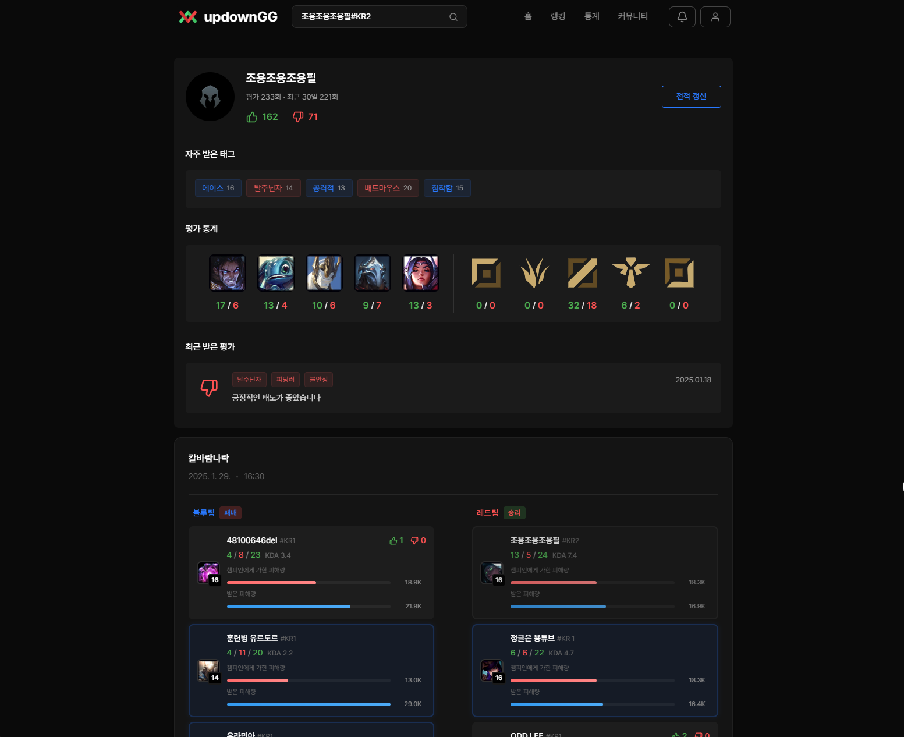

#### 매치 리스트 섹션
| 매치 정보 | 참여 소환사 카드 |
|-----------|------------------|
| • 큐 타입<br>• 플레이 일자<br>• 경기 시간 | • 챔피언 아이콘 및 레벨<br>• 소환사 정보<br>• KDA<br>• 피해량<br>• 총 UP/DOWN 수 |

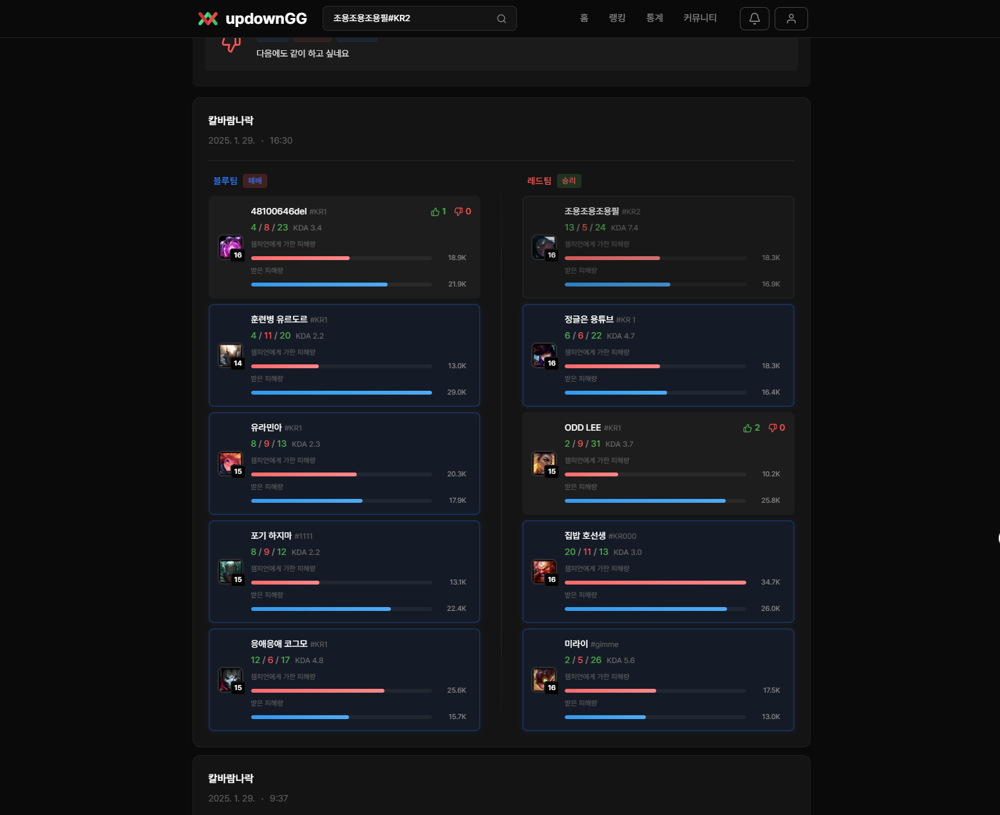

### 5️⃣ 평가 작성 모달
```
✍️ 공정한 평가로 건강한 게임 문화를 만들어요
```
#### 평가 시스템
| 평가 항목 | 접근 제한                                                                                       |
|-----------|---------------------------------------------------------------------------------------------|
| • UP/DOWN 선택<br>• 플레이스타일 태그 (최대 5개)<br>• 커스텀 태그 신청<br>• 익명/실명 선택<br>• 평가 내용 작성 | ✅ 로그인 사용자만 평가 가능<br>❌ 자기 자신 평가 불가<br>❌ 리뷰는 한명의 소환사에 대해 한번만 평가 가능<br>👀 다른 소환사 페이지에서는 조회만 가능 |

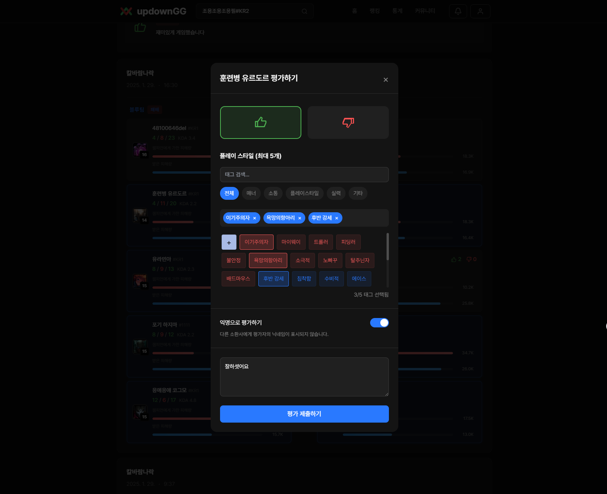
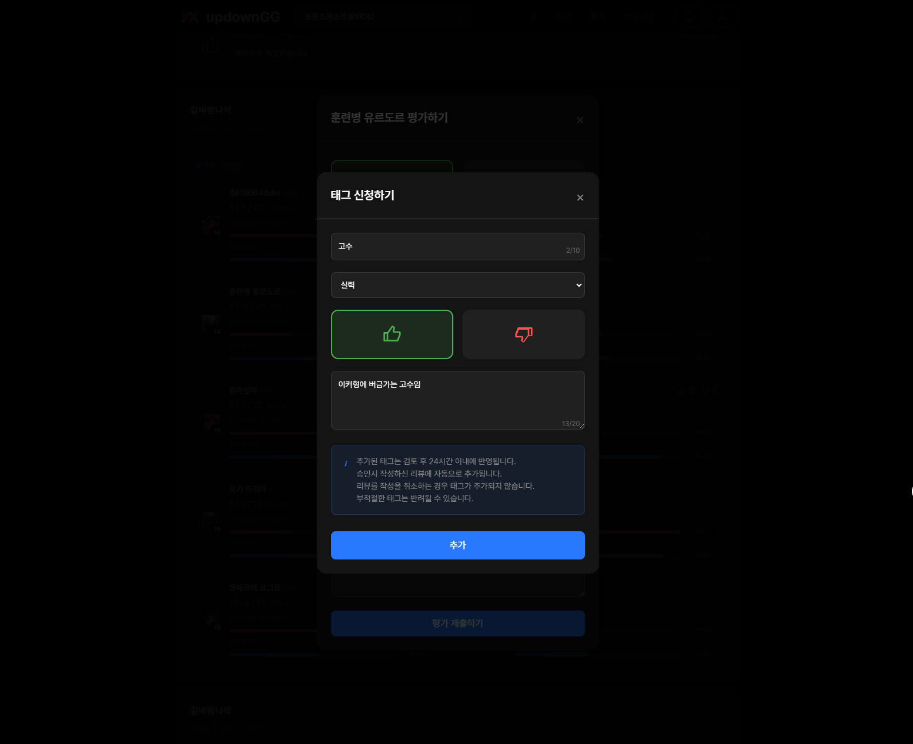
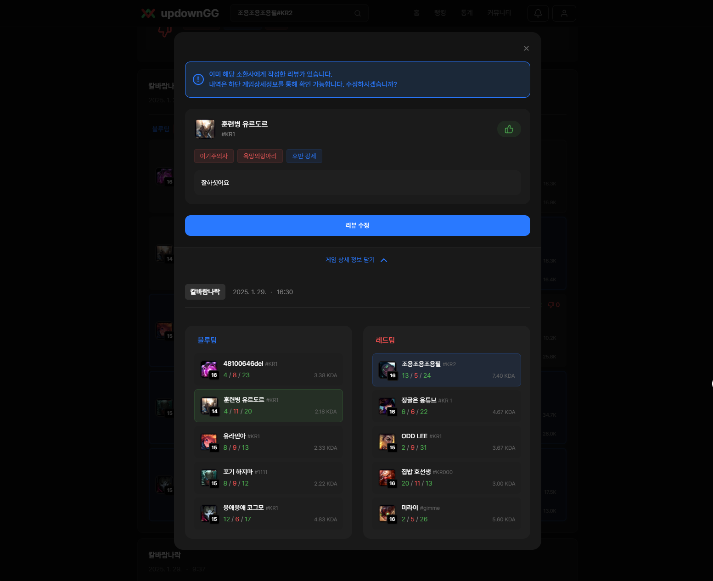

### 6️⃣ 알림 시스템
```
🔔 새로운 평가를 실시간으로 확인하세요
```
- 실시간 평가 알림
- 알림 클릭 시 해당 리뷰로 바로 이동
- 읽음/안읽음 상태 표시
- 모든 알림 읽음 처리 기능

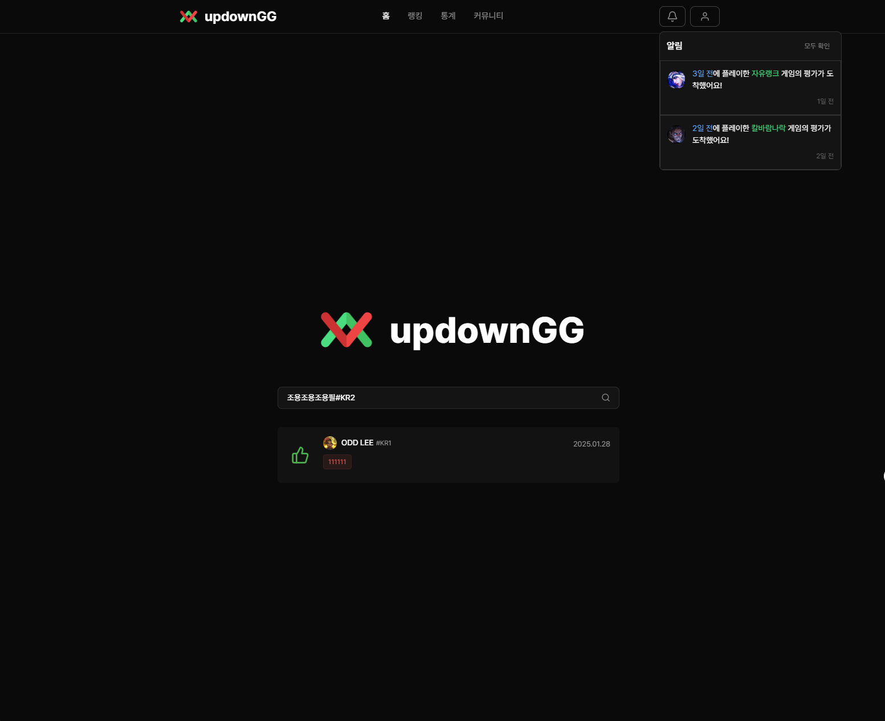
